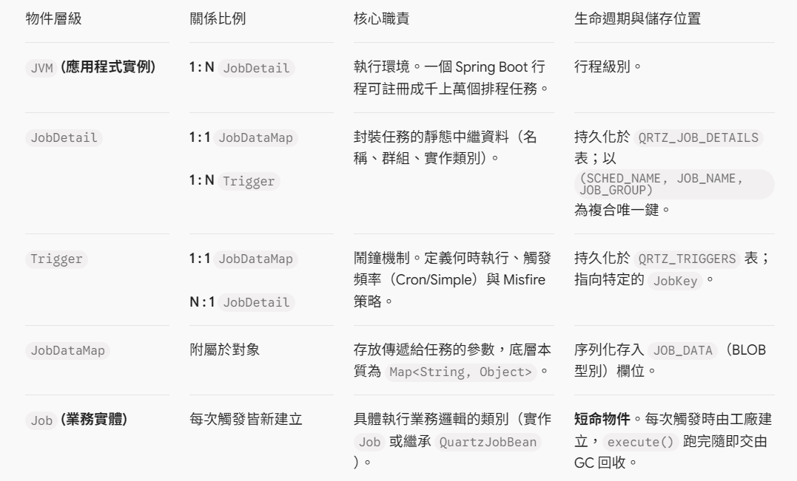
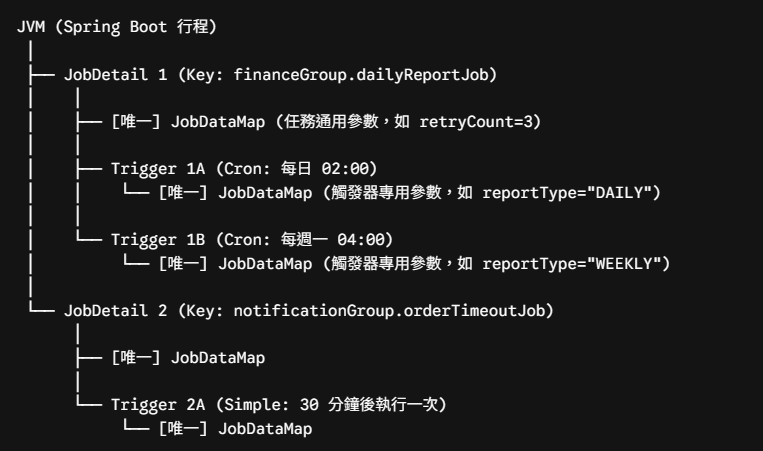

# JVM、JobDetail 與 JobDataMap 的關係

Quartz 的物件關係遵循「任務定義（What）」與「觸發時機（When）」徹底解耦的一對多結構：

## 結構拓撲圖

## 一、執行期參數合併機制（Runtime Snapshot）

當排程到達觸發時間，Quartz 執行緒並不會直接修改靜態的 `JobDetail` 或 `Trigger`，而是生成單次執行的上下文：

1. **實例化**：透過 `SpringBeanJobFactory` 反射建立 `Job` 實體，並注入 Spring Bean。
2. **合併 Map**：生成該次執行獨享的 `MergedJobDataMap`：
   - `JobDetail 的 JobDataMap` + `Trigger 的 JobDataMap` ➞ `MergedJobDataMap`
3. **覆蓋規則**：若有同名 Key，Trigger 的參數優先覆蓋 JobDetail 的參數。
4. **隔離性**：不同執行緒、不同節點之間的 `MergedJobDataMap` 彼此獨立，記憶體不互相干擾。

## 二、核心使用與避坑原則

### 1. 嚴禁傳遞複雜實體
`JobDataMap` 在 JDBC 模式下預設走 Java 原生二進位序列化存入 BLOB。若傳入自訂 DTO，後續系統改版修改欄位會引發 `InvalidClassException` 導致排程永久中斷。
- **黃金原則**：只傳業務唯一識別碼（如 `orderId`）或 JSON String，進入 `execute()` 後再透過 Spring Service 查 DB 最新狀態。

### 2. 跨節點狀態回寫
若需在多個週期或節點間累加計數，需同時標註：
- `@PersistJobDataAfterExecution`：執行完成後將 Map 序列化寫回資料庫。
- `@DisallowConcurrentExecution`：避免並行執行時產生資料覆寫與 Race Condition。
