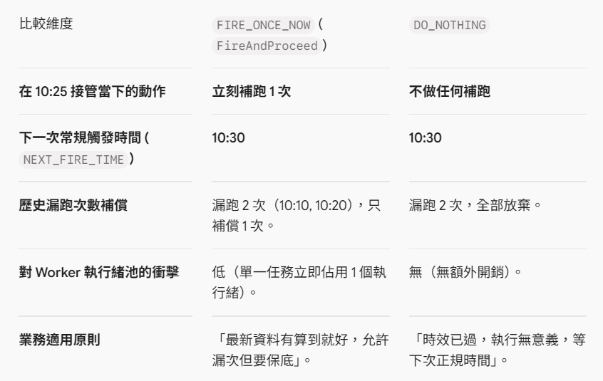

# Quartz CronTrigger 的 Misfire 策略

在 Quartz 叢集中，當節點發生當機、心跳逾時並完成 Failover 接管後，最常面臨的狀況就是：原本預計執行的時間點已經過去了。此時觸發器是否被認定為「Misfire（錯過觸發）」，以及隨後如何修正排程時間，完全由 `misfireThreshold` 與 CronTrigger 的 Misfire 處理策略決定。

## 判定 Misfire 的關鍵門檻（misfireThreshold）

Quartz 不會因為任務延遲了幾毫秒就立刻認定為 Misfire。它在 `quartz.properties` 中定義了一個容忍窗口：

```properties
# 預設為 60000 毫秒（60 秒）
org.quartz.jobStore.misfireThreshold = 60000
```

- **正常容忍範圍**：若 Failover 在短時間內（≤ 60 秒）迅速完成，且當前時間與預定觸發時間的差距小於 60 秒，Quartz 會將其視為「正常的輕微延遲」，直接立即執行該任務，不進入 Misfire 處理分支。
- **判定為 Misfire**：若節點當機停頓、重啟或接管耗時過長，使得 `now - NEXT_FIRE_TIME > misfireThreshold`，Quartz 就會將該觸發器判定為「已錯過觸發（Misfired）」，此時必須讀取該 Trigger 上設定的指令來決定下一步。

## CronTrigger 核心策略在 Failover 後的行為差異

針對 CronTrigger，Quartz 提供了以下三種主要策略（透過 `CronScheduleBuilder` 設定）：

### 1. MISFIRE_INSTRUCTION_FIRE_ONCE_NOW（立即補跑一次）

- **API 寫法**：
  ```java
  CronScheduleBuilder.cronSchedule("0 0/10 * * * ?")
      .withMisfireHandlingInstructionFireAndProceed() // 等同於 FIRE_ONCE_NOW
  ```
- **Failover 接管後的運作**：
  救援節點接管後，發現任務已超過閾值。叢集會立刻產生一次執行訊號，指派手邊可用的 Worker 執行緒立刻補跑一次。補跑的同時，依據當前的系統時間重新計算下一個符合 Cron 表達式的時間點更新進 `NEXT_FIRE_TIME`。
- **多週期錯過時的表現**：
  若伺服器停機 1 小時，原本每 10 分鐘應跑一次（共錯過了 6 次），它只會補跑 1 次，不會把錯過的 6 次連續狂補 6 遍（避免對系統造成雪崩式壓垮）。
- **適合情境**：
  報表統計、快取更新、每日維護等「只要有更新到最新狀態即可，不在乎中間少跑幾次」的任務。

### 2. MISFIRE_INSTRUCTION_DO_NOTHING（忽略過去，等待下一次）

- **API 寫法**：
  ```java
  CronScheduleBuilder.cronSchedule("0 0/10 * * * ?")
      .withMisfireHandlingInstructionDoNothing()
  ```
- **Failover 接管後的運作**：
  救援節點判定任務錯過觸發。完全不補跑任何任務。直接以當前時間點（now）為基準，重新計算未來的下一個符合 Cron 規則的時間點，更新 `NEXT_FIRE_TIME`，狀態恢復為 `WAITING`。
- **適合情境**：
  時效性極高且過期無效的任務。例如「開盤前 8:55 推播即時早報」或「上午 10:00 發送快閃特賣提醒」。若因 Failover 拖到 10:30 才恢復，補發早報或特賣通知只會困擾使用者。

### 3. MISFIRE_INSTRUCTION_IGNORE_MISFIRE_POLICY（強制全數回溯補跑）

- **API 寫法**：
  ```java
  CronScheduleBuilder.cronSchedule("0 0/10 * * * ?")
      .withMisfireHandlingInstructionIgnoreMisfires()
  ```
- **Failover 接管後的運作**：
  Quartz 在底層完全不把逾時當作 Misfire 處理。救援節點會不斷使用過去的 `NEXT_FIRE_TIME` 推進時間，將伺服器當機期間漏掉的每一個排程點「全部補跑一遍」，直到觸發時間追上當前時間為止。
- **潛在風險**：
  若系統停機數天，且排程頻率很高，節點接管後會瞬間觸發成千上萬個補跑任務，極易造成資料庫連線池耗盡或 Worker 執行緒池被瞬間打爆。
- **適合情境**：
  財務結算、計費批次扣款、必須嚴格按每期順序且一次都不能漏的審計任務（但這類場景通常更建議搭配批次框架如 Spring Batch 處理）。

---

## 兩大策略行為對比（以每 10 分鐘執行為例）

**情境**：任務每 10 分鐘執行一次（10:00、10:10、10:20...）。
**事件**：節點在 10:00 執行完後崩潰，直到 10:25 救援節點才完成 Failover 並偵測到 Misfire（錯過了 10:10 與 10:20）。



---

## 搭配 RequestsRecovery 實務交叉影響

在規劃 Failover 時，常有開發者混淆 `RequestsRecovery` 與 `Misfire Instruction` 的職責邊界：

- **JobDetail.requestsRecovery = true**：只負責「當機那一刻正在跑（`EXECUTING`）的那個任務實例」。它的救援邏輯是為該實例產生一個 `RECOVERY` 狀態的觸發器立刻重跑。
- **Misfire Instruction**：負責「當機期間因無人處理而錯過觸發時間的未來 Triggers」。

### 最佳實踐組合：

1. **任務本身必須具備資料冪等性**（防止 requestsRecovery 造成重複執行時引發髒資料）。
2. **定期輪詢、報表更新型任務**，建議配置 `withMisfireHandlingInstructionFireAndProceed()`，確保系統恢復後能補償一次最新狀態。
3. **即時推播、強時效性任務**，務必配置 `withMisfireHandlingInstructionDoNothing()`，防止節點恢復後大量發送過期無效的通知。
