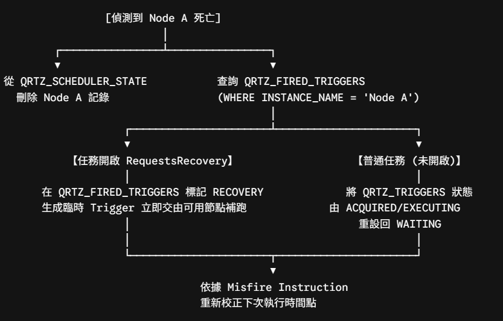
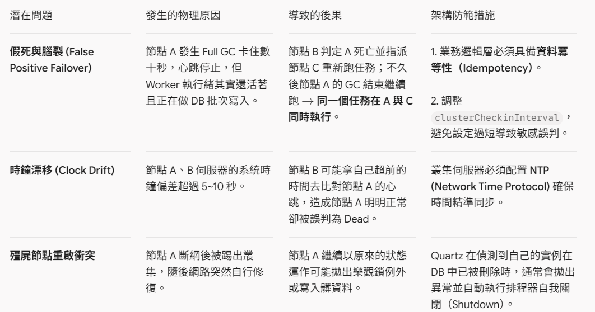

# Quartz 叢集的 Failover 機制

Quartz 的 Failover（故障移轉）機制本質上是一種「基於資料庫狀態與悲觀鎖的被動接管機制」。崩潰的節點無法對外求救，而是由叢集中其他健康的節點在週期性巡檢時發現異常，並負責「清理遺體」與「重置任務」。

## 核心階段

整個 Failover 生命週期可以拆解為以下幾個核心階段：
1. 心跳回報與存活宣告（Heartbeat）
2. 死亡判定（Dead Instance Detection）
3. 救援與狀態重置（Recovery 核心邏輯）

---

### 一、 心跳回報與存活宣告（Heartbeat）

每個加入叢集的 Quartz 實例（Instance），內部都會啟動一個背景守護執行緒 `ClusterManager`。

- **節點註冊**：節點啟動時，會向 `QRTZ_SCHEDULER_STATE` 插入一筆屬於自己的紀錄：
  - `SCHED_NAME`：排程器名稱。
  - `INSTANCE_NAME`：節點唯一識別碼（設定為 AUTO 時通常是 `主機名稱 + 時間戳`）。
  - `LAST_CHECKIN_TIME`：當前時間戳（毫秒）。
  - `CHECKIN_INTERVAL`：回報心跳的頻率（由 `org.quartz.jobStore.clusterCheckinInterval` 設定，預設為 7500 ms，即 7.5 秒）。

- **週期回報**：`ClusterManager` 每隔設定的時間間隔，就會更新自己的時間戳：
  ```sql
  UPDATE QRTZ_SCHEDULER_STATE 
  SET LAST_CHECKIN_TIME = :currentTime 
  WHERE SCHED_NAME = :schedName AND INSTANCE_NAME = :instanceName;
  ```

---

### 二、 死亡判定（Dead Instance Detection）

當節點 A 因 JVM Crash、OOM、機器斷電或網路 Partition 斷線時，節點 A 停止更新心跳。此時由其他存活節點（例如節點 B）在執行自己的心跳巡檢時進行偵測：

1. **競爭狀態排他鎖**：節點 B 為了防止與節點 C 同時發起容災處理，必須先對 `QRTZ_LOCKS` 加鎖：
   ```sql
   SELECT * FROM QRTZ_LOCKS WHERE SCHED_NAME = :schedName AND LOCK_NAME = 'STATE_ACCESS' FOR UPDATE;
   ```
2. **計算逾時閥值**：節點 B 掃描 `QRTZ_SCHEDULER_STATE` 表中的所有節點，計算條件：
   `now - LAST_CHECKIN_TIME > (該節點的 CHECKIN_INTERVAL + 容忍寬限期)`
   Quartz 預設的容忍寬限期通常也是一個 `CHECKIN_INTERVAL`（加上些許緩衝時間）。若超過此時間未更新，節點 A 就被正式標記為 Dead Instance。

---

### 三、 救援與狀態重置（Recovery 核心邏輯）

確定節點 A 死亡後，搶到 `STATE_ACCESS` 鎖的節點 B 會接管處置。這是一項繁瑣的「清場」工作，針對不同的任務配置有不同的處置流程：



1. **刪除死亡節點**
   從 `QRTZ_SCHEDULER_STATE` 刪除節點 A 的紀錄，宣告其退出叢集。

2. **檢視節點 A 當下正在執行的任務**
   節點 B 查詢 `QRTZ_FIRED_TRIGGERS` 表，找出 `INSTANCE_NAME = 'Node A'` 的所有紀錄：
   - **情況 A：任務設定了 RequestsRecovery（推薦重要任務啟用）**
     若在定義 JobDetail 時設定了 `.requestRecovery(true)`：Quartz 認定這個任務在崩潰前「未確認完成」，因此會將該條觸發記錄的狀態改為 `RECOVERY`。叢集會為其生成一個特殊的內部恢復觸發器，讓健康的節點立刻重新執行該任務（重跑時，可透過 `context.isRecovering()` 判斷此任務是否為 Failover 補跑）。
   - **情況 B：一般任務（未開啟 Recovery）**
     節點 B 直接將 `QRTZ_FIRED_TRIGGERS` 中節點 A 的記錄清除。將關聯的 `QRTZ_TRIGGERS` 狀態由 `ACQUIRED` 或 `EXECUTING` 復原為 `WAITING`。

3. **處理併發約束與 Misfire**
   - **@DisallowConcurrentExecution 解鎖**：若節點 A 當機時執行的是單一並行限制任務，其狀態可能停留在 `BLOCKED`。救援節點會一併解除鎖定，將其轉回 `WAITING`。
   - **Misfire 判定**：若節點 A 當機時間過長，任務原定的執行時間早已過去，救援節點會讀取 Trigger 設定的 Misfire Instruction（例如：`withMisfireHandlingInstructionFireAndProceed` 補跑一次，或是 `withMisfireHandlingInstructionDoNothing` 直接跳過等下次），調整 `NEXT_FIRE_TIME`。

處置完畢後，節點 B 提交資料庫交易並釋放 `STATE_ACCESS` 鎖。至此，Failover 流程全部結束。

---

### 實務上必須防範的邊界問題（Pitfalls）

雖然 Quartz 的 Failover 邏輯很嚴謹，但底層設計有幾處實務邊界情況需要特別防護：


