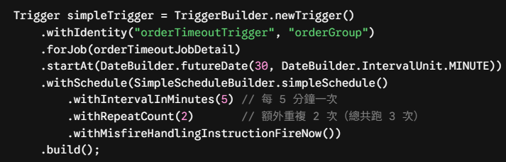
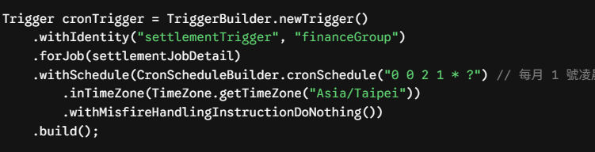
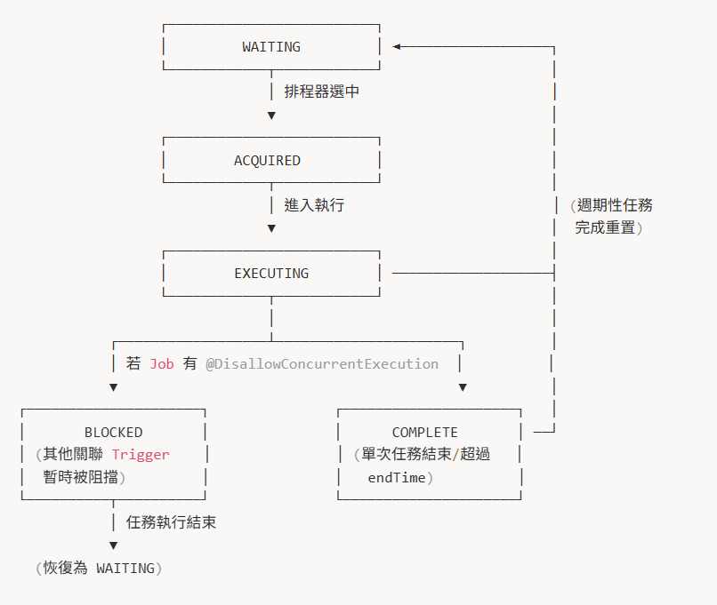
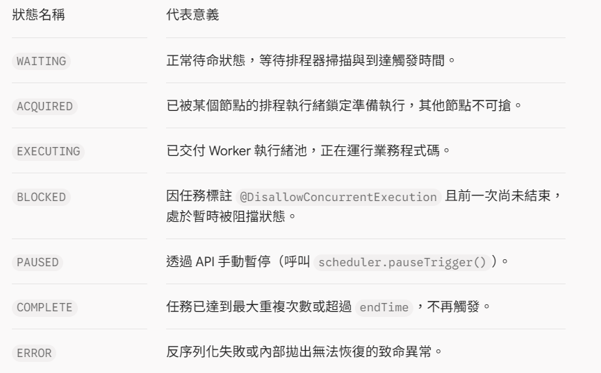

# Quartz 的觸發器 Trigger

在 Quartz 的架構中，**Trigger（觸發器）** 是負責回答「何時執行（When）」的關鍵物件。它與 JobDetail（執行什麼）完全解耦，主要維護觸發時間點、執行間隔、優先級、有效期限以及錯過觸發時的補救策略。

## 一、核心屬性（Trigger 的共用特徵）

不論哪種具體實作，所有 Trigger 都繼承自 `org.quartz.Trigger` 介面，具備以下關鍵屬性：

- **TriggerKey（name + group）**：全域唯一標識符（例如 `name="dailySyncTrigger"`, `group="syncGroup"`）。在同一 Group 內名稱不可重複。
- **JobKey**：明確綁定該 Trigger 觸發哪一個 JobDetail（兩者為 $N:1$ 關係）。
- **startTime / endTime**：定義觸發器的生效生命週期。在 startTime 之前或 endTime 之後，排程器都不會觸發該任務。若未指定 endTime，則代表無限期生效。
- **priority（優先級）**：預設值為 5。當系統執行緒池（ThreadPool）滿載，且在同一時刻有多個 Trigger 同時到達觸發時間時，數值越大的 Trigger 越先被執行緒分配執行。
- **JobDataMap**：每個 Trigger 擁有專屬的參數 Map。當此 Trigger 觸發時，其參數會覆蓋 JobDetail 上的同名參數。
- **misfireInstruction**：逾時容忍處理策略（伺服器停機重啟或執行緒耗盡時的應對措施）。

## 二、常見的 Trigger 類型與實作

Quartz 提供了四種主要的 Trigger 實作，其中前兩種覆蓋了 95% 以上的業務場景：

### 1. SimpleTrigger（簡單時間觸發器）
適合固定間隔、指定重複次數或精確延遲的任務。
- **核心參數**：
  - `repeatInterval`：重複間隔（毫秒）。
  - `repeatCount`：重複次數（例如 `repeatCount=0` 表示只跑 1 次，`repeatForever()` 則表示無限重複）。
- **典型場景**：
  - 使用者下單後，30 分鐘後執行一次「檢查超時未付款關單」。
  - 系統重啟後，每 10 秒檢查一次硬體狀態，共檢查 6 次。
- **Java 建立範例**：
  

### 2. CronTrigger（日曆排程觸發器）
適合基於自然日曆、複雜週期的任務。
- **核心參數**：
  - `cronExpression`：支援 6 到 7 個欄位的 Cron 表達式（秒、分、時、日、月、週、年）。
  - `timeZone`：支援時區設定（跨國排程不可忽視）。
- **典型場景**：
  - 每週一至週五上午 9:30 開盤同步。
  - 每月最後一天 23:59 進行月結算。
- **Java 建立範例**：
  

### 3. CalendarIntervalTrigger（日曆間隔觸發器）
適合以「日、週、月、年」為單位的間隔任務，特別能正確處理夏令時間（DST, Daylight Saving Time）與大小月份。
- **痛點**：若用 SimpleTrigger 設定「每隔 1 個月跑一次」，因不同月份有 28、30、31 天，固定毫秒間隔會逐漸失準。
- **解法**：CalendarIntervalTrigger 會自動理解日曆邏輯，確保每次都是精確在「隔月的同一日同一時刻」觸發。

### 4. DailyTimeIntervalTrigger（每日時間區間觸發器）
適合限制在「每天的某個時間區間內」高頻執行的任務。
- **例如**：只在「每週一至週五，早上 09:00 至下午 18:00 之間，每隔 15 分鐘執行一次」。

## 三、Trigger 的狀態機流轉（Trigger State）

在 JDBCJobStore 模式下，Trigger 的狀態記錄在 `QRTZ_TRIGGERS` 表的 `TRIGGER_STATE` 欄位中，其狀態流轉由排程引擎完全控制：

### 流程圖

### 狀態對照

## 四、避坑與架構重點

- **Trigger 與 JobDetail 的生命週期相依性**：若使用 SimpleTrigger 跑單次任務，當任務執行完畢轉為 `COMPLETE` 狀態後，Quartz 預設會將該 Trigger 從資料庫刪除。如果對應的 JobDetail 當初沒有設定 `.storeDurably(true)`，當最後一個 Trigger 被刪除時，該 JobDetail 也會連帶被從資料庫徹底刪除。
- **動態更新時間（Rescheduling）**：運行時若要修改 Cron 表達式，不要刪除整組 Job，而是使用 `scheduler.rescheduleJob(TriggerKey, newTrigger)`。它會原子地替換資料庫中的 Trigger 定義並重新計算 `NEXT_FIRE_TIME`。
- **時區陷阱**：Cron 表達式不指定時區時，預設會取伺服器作業系統的預設時區（`TimeZone.getDefault()`）。若叢集伺服器分布在不同雲端 Region 且時區未統一設定為 UTC 或 CST，會造成任務觸發時間不一致。
