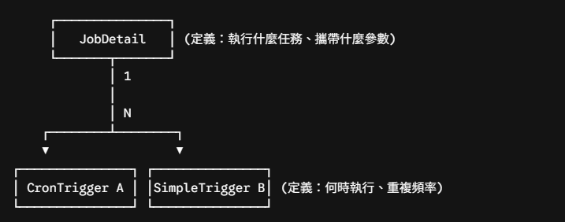
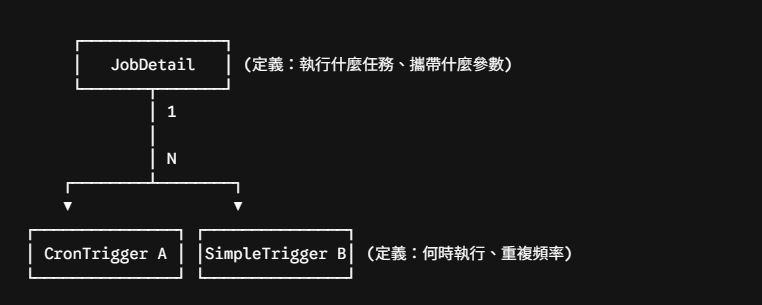

# Spring 與 Quartz 的整合

在 Spring 與 Quartz 整合（`spring-boot-starter-quartz`）的架構中，Spring 並沒有重寫 Quartz 的排程核心，而是透過依賴注入（IoC）、工廠 Bean 以及專屬的 Builder，將 Quartz 的原生排程概念轉化為 Spring 容器可管理的 Bean。

整體核心圍繞在 **Scheduler（排程器引擎）**、**JobDetail（任務定義）** 與 **Trigger（觸發器）** 的三角關係，並由 Spring 提供黏著劑。



## 一、核心物件：JobDetail 與 Trigger

這是 Quartz 最核心的一對多架構設計：任務本體（What）與觸發時機（When）完全解耦，同一個 JobDetail 可以綁定多個不同的 Trigger，在不同時間點以不同參數觸發。



### JobDetail（任務定義與中繼資料）

- **職責**：Quartz 每次執行任務時，並不會重複使用同一個 Java 實例，而是每次觸發都重新 `new` 一個 Job 物件，執行完畢後立即交由 GC 回收。因此，我們不能直接將 Job 物件註冊進排程器，而是透過 JobDetail 儲存該任務的靜態中繼資料。
- **核心屬性**：
  - **JobKey（name + group）**：全域唯一識別碼。例如 `name="dailyReportJob"`, `group="financeReportGroup"`。
  - **jobClass**：實作 `org.quartz.Job` 介面的 Class（例如 `DailyReportJob.class`）。
  - **JobDataMap**：本質是個 `Map<String, Object>`，用來存放任務需要的靜態參數或初始配置。在 JDBC 模式下，內容會被序列化後寫入 `QRTZ_JOB_DETAILS` 表中。
  - **durability（持久性）**：若設為 `false`，當沒有任何 Trigger 指向該 Job 時，它會自動被資料庫清除；一般常態性任務通常設為 `storeDurably(true)`，即使暫時沒有 Trigger 也能留在系統中。
  - **requestsRecovery（故障重試）**：若設為 `true`，節點執行中途當機時，Failover 救援節點接管後會立刻補跑一次。

### Trigger（觸發器）

- **職責**：決定任務何時被放進執行緒池執行。它維護了觸發規則、下次觸發時間（`NEXT_FIRE_TIME`）與優先順序。
- **核心屬性**：
  - **TriggerKey（name + group）**：觸發器的唯一識別碼。
  - **JobKey**：指向此 Trigger 負責觸發的那個 JobDetail。
  - **JobDataMap**：Trigger 本身也可以攜帶專屬的 JobDataMap。如果 Trigger 與 JobDetail 有同名參數，Trigger 的數值會覆蓋 JobDetail 的數值。
  - **priority**：當執行緒池滿載且有多個 Trigger 同時到達觸發時間時，優先權高的先被執行。
  - **misfireInstruction**：錯過觸發時間時的補救策略（如 `FireAndProceed` 或 `DoNothing`）。
- **最常見的實作**：
  - **SimpleTrigger**：適合固定延遲或間隔頻率（如「5 分鐘後執行」、「每隔 10 秒執行一次，共 3 次」）。
  - **CronTrigger**：支援 Cron 表示式，適合複雜日曆邏輯（如「每月 1 號凌晨 2 點」、「週一至週五上午 9:30」）。

## 二、Spring 整合 Quartz 的專屬相關物件

為了讓 Quartz 能自然地融入 Spring 生態，Spring 提供了以下關鍵的適配與工廠類別：

### SchedulerFactoryBean
- **職責**：Spring 整合 Quartz 的心臟。它是一個 Spring `FactoryBean`，負責初始化、配置與管理 Quartz Scheduler 的生命週期。
- 自動讀取 `application.yml` 或 `quartz.properties`，設定 ThreadPool、JobStore，並確保在 Spring 容器啟動完成後啟動排程器（`start()`），在 Spring 容器關閉時優雅停機（`shutdown(true)`）。

### SpringBeanJobFactory
- **職責**：解決「如何在 Job 中使用 `@Autowired`」的關鍵物件。
- **痛點**：Quartz 原生架構在觸發時是利用反射 `Class.newInstance()` 建立 Job，這樣實例化出來的物件並不受 Spring 管理，裡面的 `@Autowired` Service 全部會是 null。
- **機制**：Spring 透過繼承 Quartz 的 `JobFactory`，在 Job 實例被反射建構出來後，自動將當前的 `ApplicationContext` Autowire Capable BeanFactory 注入進去，替 Job 實例手動完成依賴注入。

### JobDetailFactoryBean 與 CronTriggerFactoryBean
Spring 提供的 Convenience 工廠類別，封裝了原生 Builder 冗長的建構代碼，能以標準 Spring Bean 的方式在 `@Configuration` 中宣告定義。

### QuartzJobBean
這是 Spring 提供的抽象基底類別（實作了 Quartz 原生的 Job 介面）。它重寫了原生的 `execute(JobExecutionContext)`，自動解析 JobDataMap 的參數並注入到 Job 的屬性欄位，最後開放一個更乾淨的 `executeInternal(JobExecutionContext)` 給開發者實作。

## 三、完整宣告與 MVP 實作範例

### 1. 任務實作：繼承 QuartzJobBean

```java
@Component
@DisallowConcurrentExecution // 同一 Job 實例在執行完成前，下一次不准重複觸發
public class OrderSettlementJob extends QuartzJobBean {

    // SpringBeanJobFactory 會自動幫忙注入 Spring 管理的 Bean
    @Autowired
    private OrderService orderService;

    // 若 JobDataMap 內有同名 key，QuartzJobBean 會自動調用 Setter 注入
    private String settlementDate;

    public void setSettlementDate(String settlementDate) {
        this.settlementDate = settlementDate;
    }

    @Override
    protected void executeInternal(JobExecutionContext context) throws JobExecutionException {
        // 從 context 取得執行中繼資料
        String jobName = context.getJobDetail().getKey().getName();
        System.out.println("開始執行任務: " + jobName + "，日期: " + settlementDate);
        orderService.processSettlement(settlementDate);
    }
}
```

### 2. 配置類別：定義 JobDetail 與 Trigger Bean

Spring Boot 在偵測到容器內有 JobDetail 與 Trigger 的 Bean 時，`SchedulerFactoryBean` 會自動將它們關聯並註冊到排程器中，不需手動寫 `scheduler.scheduleJob(...)`：

```java
@Configuration
public class QuartzConfig {

    // 1. 定義 JobDetail
    @Bean
    public JobDetail orderSettlementJobDetail() {
        return JobBuilder.newJob(OrderSettlementJob.class)
                .withIdentity("orderSettlementJob", "financeGroup")
                .withDescription("每日訂單結算任務")
                .usingJobData("settlementDate", "TODAY") // 預設 JobDataMap 參數
                .storeDurably(true)                      // 沒有 Trigger 時仍保存在 DB
                .requestRecovery(true)                   // 節點崩潰接管後補跑
                .build();
    }

    // 2. 定義 Trigger 並綁定 JobDetail
    @Bean
    public Trigger orderSettlementTrigger(JobDetail orderSettlementJobDetail) {
        return TriggerBuilder.newTrigger()
                .forJob(orderSettlementJobDetail) // 明確綁定上述 JobDetail
                .withIdentity("orderSettlementTrigger", "financeGroup")
                .withSchedule(CronScheduleBuilder.cronSchedule("0 0 2 * * ?") // 每天凌晨 2:00
                        .withMisfireHandlingInstructionFireAndProceed())       // 逾時補跑策略
                .build();
    }
}
```

## 四、總結關係鏈

- **Job (或 QuartzJobBean)**：任務的「業務程式碼」。
- **JobDetail**：包裝 Job Class 的「任務身分證與靜態參數」。
- **Trigger**：瞄準某張身分證的「鬧鐘與觸發規則」。
- **Scheduler**：由 `SchedulerFactoryBean` 產生，負責看鬧鐘（Trigger），鬧鐘響了就叫 `SpringBeanJobFactory` 生產出注入完畢的 Job 實例送去 ThreadPool 跑。
